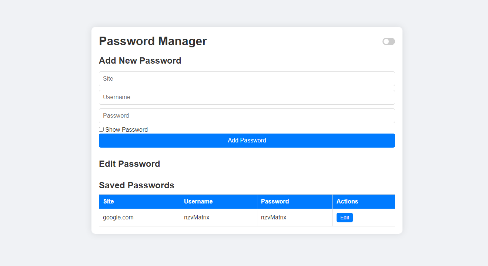
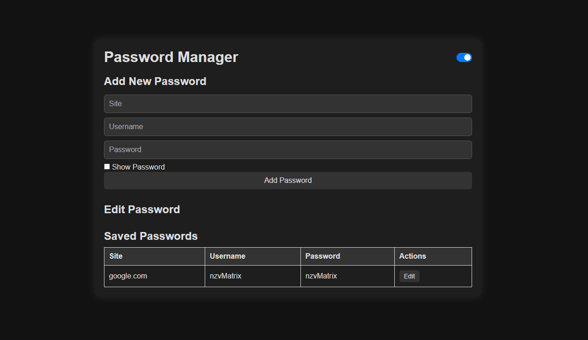

# Password Manager

A simple and secure password manager built with Flask and SQLite. This application allows users to add, view and edit passwords, toggle dark/light mode and view passwords with a show/hide option.

## Features

- **Add New Passwords**: Store site, username, and password information.
- **View Saved Passwords**: Display a list of stored passwords with site and username details.
- **Edit Existing Passwords**: Update your saved passwords as needed.
- **Toggle Dark/Light Mode**: Switch between dark and light themes for a personalized experience.
- **Show Password**: Easily view your passwords when needed.

## Installation

1. **Clone the Repository**:
    ```bash
    git clone https://github.com/nzvMatrix/password-manager.git
    ```

2. **Navigate to the Project Directory**:
    ```bash
    cd password-manager
    ```

3. **Install Dependencies**:
    Make sure you have `pip` installed, then run:
    ```bash
    pip install -r requirements.txt
    ```

4. **Initialize the Database**:
    Run the following command to set up the SQLite database:
    ```bash
    python app.py
    ```

## Usage

1. **Start the Flask Server**:
    ```bash
    python app.py
    ```

2. **Access the Application**:
    Open your web browser and go to [http://127.0.0.1:5000](http://127.0.0.1:5000).

## Contributing

Contributions are welcome! Feel free to fork the repository and submit pull requests.

## License

This project is licensed under the MIT License. See the [LICENSE](LICENSE) file for details.

## Screenshots

### Light Mode


### Dark Mode


## Acknowledgements

- [Flask](https://flask.palletsprojects.com/) for the web framework.
- [SQLite](https://www.sqlite.org/) for the database.

